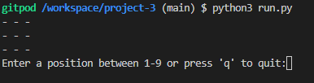
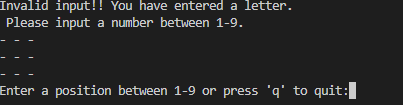
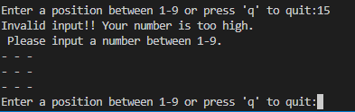
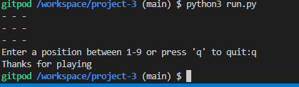
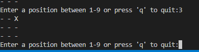
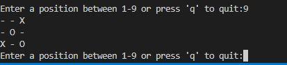
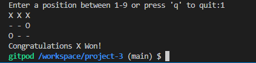
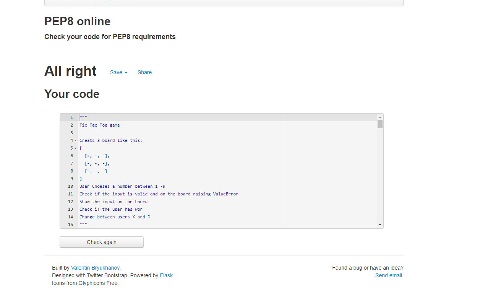

# **Tic Tac Toe**

I have decided to make a Tic Tac Toe game as my third project using python. This game allows two users to play a game of Tic Tac Toe agianst each other.
The game is a two player game. A player wins by lining up three X's or three O's in a row either horizontally, diagonally or vertically.

ALL IMAGES WHERE TAKEN FROM THE TERMINAL DUE TO HEROKU GITHUB INTEGRATION BEING DOWN. 

ERROR EXPLAINED BELOW IN DEPLOYMENT SECTION. STUDENT SUPPORT HAS BEEN CONTACTED

## **Feautures of the Game**

- ### **Start of Game**

  - The game begins by asking the user to input a number between 1-9.
  - This prompts the user to make their first move.

    

- ### **Invalid Input Handling**

  - When a user inputs a letter the code raises a ValueError
  - This explains that the user has input a letter and prompts the user once agian to enter a number between 1-9

    

  - When a user inputs a number higher than 9 or lower than 1 a ValueError.
  - This explains how the number is too high and the user must enter a number between 1-9.
  - The propmt to enter a number enters again.

    

- ### **Quit Function**

  - The user has the ability to stop playing the game at any moment by pressing q
  - This causes the game to break out of the while loop and stop the game

    

- ### **Correct input recieved**

  - When a correct input has been recieved an X or an O is placed on the board
  - X takes the first turn and after that its O's turn
  - The users take turns placing their character on the board
  - After each turn the character switches

    

    

- ### **User Wins Game**

  - When a user wins the game a congratulations prompt appears and the game loop stops with break.
  - The prompt tells you whether X's or O's wont the game.
  - The board is shown to show how the user won the game.

  

- ### **The Game is a Tie**

  -  When the game is a tie the game ends with a prompt that the game is a tie.
  - The users then have to restart the game from the beginnning.

    

## **Testing**

- ### **Input Testing**

  - I tested all the input possible into the console.
  - All inputs working as intended without issues

- ### **Error Testing**

  - All error are dealt with correctly
  - The right error message appears and the game does not stop or crash

- ### **Quit Testing**

  - The quit funtion works as intended.
  -  Allows the user to quit the game at any moment

- ### **Win/Tie Testing**

  - Both win and tie work as intended showing the right message and ending the game
  - The board shows the user the outcome of the game

## **Validator Testing**

  - I have used the PEP8 online test to check my code.
  - No issues or warnings arose.

    

## **Unfixed Bugs**

  - No unfixed bugs were found during testing

## **Fixed Bugs**

**Bug**

- When input was 1 X or O did not show on board
  - This bug caused all inputs to work but 1

  **Fix**

  - I fixed this by removing the else from the validate_input function

**Bug**

- User would win when having only two slots on the board
  - The user would win when they placed their character in slot 1 and 5
  - This broke the game as they won with only two characters

  **Fix**

  - I added == user to the check_diagonal function in board[2][2] == user

**Bug**

- Validate input function would not work

  **Fix**