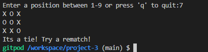
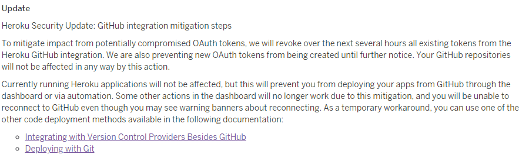

# **Tic Tac Toe**

I have decided to make a Tic Tac Toe game as my third project using python. This game allows two users to play a game of Tic Tac Toe against each other.
The game is a two player game. A player wins by lining up three X's or three O's in a row either horizontally, diagonally or vertically.

ALL IMAGES WHERE TAKEN FROM THE TERMINAL DUE TO HEROKU GITHUB INTEGRATION BEING DOWN. 

~~ERROR EXPLAINED BELOW IN DEPLOYMENT SECTION. STUDENT SUPPORT HAS BEEN CONTACTED~~
**ISSUE FIXED**

Link to deployed website: [Tic Tac Toe](https://project-3-tic-tac-toe.herokuapp.com/)

## **Features of the Game**

- ### **Start of Game**

  - The game begins by asking the user to input a number between 1-9.
  - This prompts the user to make their first move.

    

- ### **Invalid Input Handling**

  - When a user inputs a letter the code raises a ValueError
  - This explains that the user has input a letter and prompts the user once again to enter a number between 1-9

    

  - When a user inputs a number higher than 9 or lower than 1 a ValueError.
  - This explains how the number is too high and the user must enter a number between 1-9.
  - The propmt to enter a number enters again.

    

- ### **Quit Function**

  - The user has the ability to stop playing the game at any moment by pressing q
  - This causes the game to break out of the while loop and stop the game

    

- ### **Correct input recieved**

  - When a correct input has been recieved an X or an O is placed on the board
  - X takes the first turn and after that its O's turn
  - The users take turns placing their character on the board
  - After each turn the character switches

    

    

- ### **User Wins Game**

  - When a user wins the game a congratulations prompt appears and the game loop stops with break.
  - The prompt tells you whether X's or O's wont the game.
  - The board is shown to show how the user won the game.

  

- ### **The Game is a Tie**

  -  When the game is a tie the game ends with a prompt that the game is a tie.
  - The users then have to restart the game from the beginnning.

    

## **Testing**

- ### **Input Testing**

  - I tested all the input possible into the console.
  - All inputs working as intended without issues

- ### **Error Testing**

  - All error are dealt with correctly
  - The right error message appears and the game does not stop or crash

- ### **Quit Testing**

  - The quit function works as intended.
  - Allows the user to quit the game at any moment

- ### **Win/Tie Testing**

  - Both win and tie work as intended showing the right message and ending the game
  - The board shows the user the outcome of the game

## **Validator Testing**

  - I have used the PEP8 online test to check my code.
  - No issues or warnings arose.

    

## **Unfixed Bugs**

  - No unfixed bugs were found during testing

## **Fixed Bugs**

**Bug**

- When input was 1 X or O did not show on board
  - This bug caused all inputs to work but 1

  **Fix**

  - I fixed this by removing the else from the validate_input function

**Bug**

- User would win when having only two slots on the board
  - The user would win when they placed their character in slot 1 and 5
  - This broke the game as they won with only two characters

  **Fix**

  - I added == user to the check_diagonal function in board[2][2] == user

**Bug**

- Validate input function would not work

  **Fix**
  - The validate function returned only True or False
  - I called the function but didn't put it in an if statement so calling the function was pointless

## **Deployment**

- There was an issue with the deployment of my project.
- Heroku stopped the authorisation of github due to a security breach.
- SEE IMAGE:

-This has stopped me from deploying my project to Heroku.

- They are actively working on a solution but I could not deploy my project as show in the walkthrough project love sandwiches
- A work around was posted on the project-portfolio-3 on slack yet the work around did not work.
- I engaged in conversation with several other users and I have followed the steps of the work around yet I receive this error message:
- When following the work around steps when I try to access my "Deployed project" I get this error:

- I have tried all the solutions proposed to me on slack and did research myself yet none if it has allowed me to access my deployed project and produce testing from there.

### **ERROR FIXED**
- The Error has been fixed and been deployed through CLI in github.
- I used CLI commands heroku login -i
- Then created an app in heroku with heroku create your_app_name_here 
- Then pushed the code to deploy the website with git push heroku main

## **Credits/Resources**

- I have used the website called [Data Flair](https://data-flair.training/blogs/python-exception-handling/) to clarify exception handling and help me write Error exceptions

- I got the idea from this video on the [website](https://www.techwithtim.net/tutorials/python-programming/tic-tac-toe-tutorial/) and took inspiration for the check_diagonal function form the isWinner function from the website.
- I did not take any other code from the website apart from the check_diagonal function which I followed similar logic for. I have changed the function to suit the needs of my code.

- I had trouble with nested loops and this website clarified it: [stackoverflow](https://stackoverflow.com/questions/52640648/python-nested-loops-printed-seats)

- Code was tested on [PEP8](http://pep8online.com/)